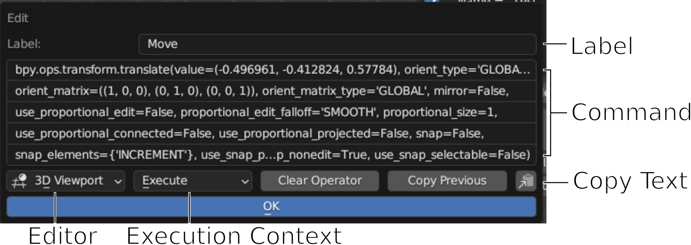
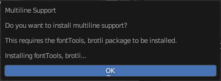

# Macro Editor
## Macro

This is a Macro it can be `activated` and `deactivated` through the checkbox and won't be executed if `deactivated`.\
By double clicking on the label the Macro can be edited through a dialog.

## Editing Macros
Double click on the Macro to open the editing dialog.

The dialog provides to different styles for operators commands or context changes.

**Operators**

**Context**

### Label
The text that is displayed for this macro.

### Command
The actual python code that will be executed for this macro.

### Properties
The area/windows where this Macro will be executed.

### Copy Text
Copies the command to the clipboard.

### Execution Context
The context which the operator will be executed with. 
Most of the time `Execution` is the right selection.

:::{Hint}
Sometimes it is helpful to set it to `Invoke` where the operator can access user input or startup a process that will not be executed immediately.
:::

### Copy Previous
Is a toggle button which will try to load the action executed before the recorded one if active.

### Clear Operator
Removes all properties from an operator.
E.g. `bpy.ops.transform.translate(value=(1,1,1), ...)` becomes `bpy.ops.transform.translate()`.

## Operations

### Add 

Adds the last used command as a Macro. 
If the `Create Empty on Error` setting is checked, an empty Macro will be created if no command is available (Shortcut: `alt + ,`).
On the first run a popup will appear asking if you want to enable [Multiline Support](../panels/macro.md#multiline-support).

### Add Event

This will show a list of possible events that can be used to create more suitable actions.

#### Event List
:::{table}
:widths: auto
| Event           | Description                                                                                                                                |
| --------------- | ------------------------------------------------------------------------------------------------------------------------------------------ |
| Clipboard       | Adds a new Macro with content of the Clipboard to the selected Action                                                                      |
| Timer           | Wait the specified time and then continue playing the Action                                                                               |
| Render Complete | Execute the blow Macros after a render completed rendering   **Note**: No alters will be shown                                          |
| Loop            | Loop the below Macros the given amount of time.   **Note**: EndLoop is need to mark the end of the loop otherwise this event is skipped |
| EndLoop         | Marks the end of the loop block                                                                                                            |
| Select Object   | Gives the option to select a specific Object in the Scene                                                                                  |
| Run Script      | Select a text from the Texteditor that is saved internally and will be executed                                                            |
:::

### Remove

Remove the selected Macro

### Move Up

Moves the selected Macro one position up

### Move Down

Moves the selected Macro one position down

### Record
When pressed the Action Recorder switches to recording mode and tries to catch every operation you do in Blender until the `Stop`-Button is pressed.
The recorded operation will automatically be added as macros.

### Clear
Removes all macros from the selected Action.

### Play
Executes all macros from the selected Action (Shortcut: `alt + .`).

### Local to Global
Moves the selected Action to the Global Panel. A popup appears to select the Category to append the Action to.
The "Settings/Buttons" below `Local to Global` decided weather to `Copy` the Action (keep this Action in `Local` and move an exact copy it to the `Global` section) or `Move` (removes this action from `Local` and append it to the `Global` section).

## Multiline Support

:::{figure-md}

First Popup to install Multiline Support
:::

If `Don't Ask Again` is checked it can be later installed in the Preferences

:::{figure-md}

Later install in the Preferences
:::

If Install is pressed the Popup will change to the following:\

After the installation finished the following appear:\
